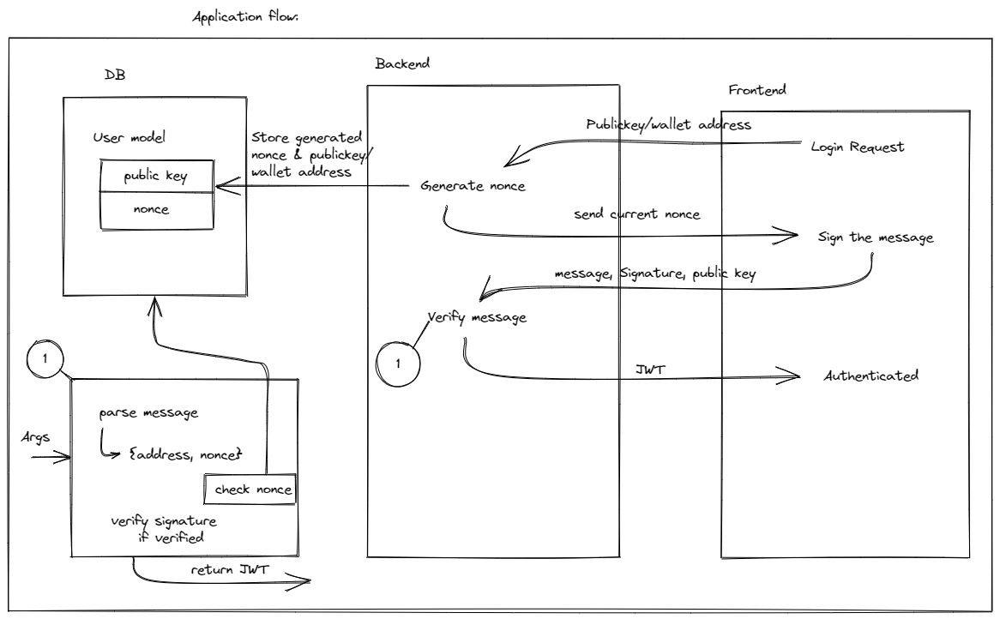

# LIWN: Login with NEAR

Authentication with NEAR wallet for web2 application. This aims to provide web2 applications with an option to integrate NEAR wallet into their application.

## How it works?

To authenticate user owns particular account, we use signature created with using private key of the user and that signature is verified by using public key of that user.

## Demo Application Flow



## Project Structure

```text
LIWN
│   
└───liwn   
│
└───Demo
    |
    └───Backend
    └───Frontend
```

## Notes

-  post endpoint was failing and giving `undefined`: You need to add following snippet so that program can parse x-www-form-urlencoded data

```js
app.use(express.urlencoded({ extended: false }));
```

